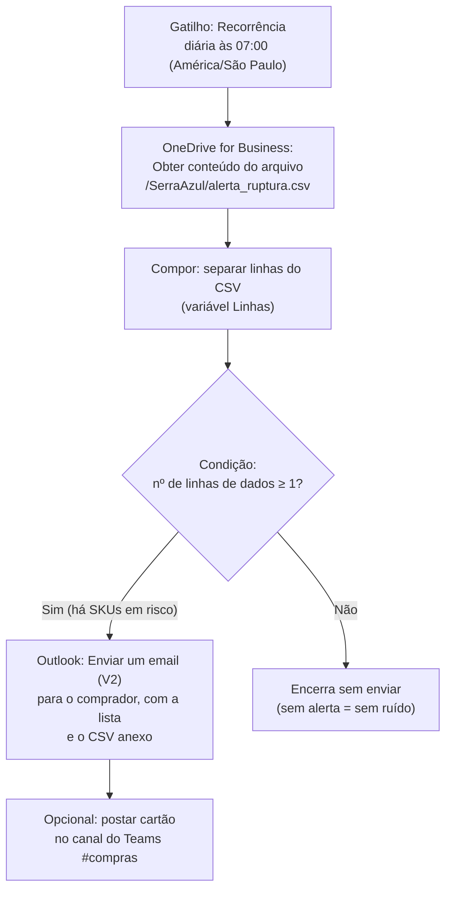

# Fluxo Power Automate — Alerta diário de risco de ruptura

> **Estudo de caso demonstrativo** — empresa fictícia com dados sintéticos.
> Documento de especificação do fluxo, para montagem manual no tenant do
> usuário (Power Automate em PT-BR). No cenário do case, um pipeline Python
> deposita diariamente o arquivo `alerta_ruptura.csv` no OneDrive; o fluxo lê
> o arquivo e avisa o comprador **antes** de o produto faltar. Para a demo,
> o arquivo é gerado por [`gerar_alerta_ruptura.py`](gerar_alerta_ruptura.py)
> e enviado ao OneDrive manualmente.

## Resumo em uma linha

**Gatilho:** todo dia às 07:00 → **fonte:** ler `alerta_ruptura.csv` no
OneDrive → **condição:** existe ≥ 1 SKU com cobertura < 7 dias? → **ação:**
e-mail em HTML para o comprador com a lista (senão, encerra sem ruído).



## Arquivo de entrada

`alerta_ruptura.csv` (UTF-8, separador vírgula), colunas:

| Coluna | Descrição | Exemplo |
|---|---|---|
| `data_referencia` | Data do cálculo | `2026-02-10` |
| `sku` | Código do produto | `SKU-0057` |
| `descricao` | Descrição do produto | `Alpina Cerveja Garrafa 600ml cx12` |
| `categoria` | Categoria | `Cerveja` |
| `estoque_atual` | Saldo em estoque (caixas/un) | `42` |
| `venda_media_dia` | Venda média diária (últimos 30 dias) | `12.7` |
| `dias_cobertura` | Estoque ÷ venda média diária | `3.3` |

Só entram no arquivo SKUs com `dias_cobertura < 7` — a mesma regra da medida
DAX "SKUs em Risco de Ruptura" da
[`especificacao_powerbi.md`](../especificacao_powerbi.md). O exemplo commitado
neste diretório foi gerado com `--data-referencia 2026-02-10` (pico do verão,
8 SKUs em risco); na última data da base (jun/2026, baixa temporada) a lista
sai vazia — útil para testar o ramo "Não" da condição.

## Pré-requisitos

- Conta Microsoft 365 com Power Automate (plano incluído no M365 basta — o
  fluxo usa apenas conectores padrão: OneDrive for Business, Outlook, Teams).
- Pasta `/SerraAzul/` no OneDrive for Business com o `alerta_ruptura.csv`.

## Passo a passo de montagem

Criar em <https://make.powerautomate.com> → **Criar** → **Fluxo de nuvem
agendado** → nome **"Serra Azul — Alerta diário de ruptura"**.

### 1. Gatilho — Recorrência

| Campo | Valor |
|---|---|
| Intervalo / Frequência | `1` / `Dia` |
| Fuso horário | `(UTC-03:00) Brasília` |
| Nos horários definidos (horas) | `7` |

### 2. Ação — Obter conteúdo do arquivo usando o caminho

Conector **OneDrive for Business** → ação **"Obter conteúdo do arquivo usando
o caminho"**:

| Campo | Valor |
|---|---|
| Caminho do arquivo | `/SerraAzul/alerta_ruptura.csv` |
| Inferir tipo de conteúdo | `Sim` |

Renomeie a ação para `LerCSV` (⋯ → Renomear) — os nomes são usados nas
expressões abaixo.

### 3. Ação — Compor (separar as linhas)

Ação **"Compor"** (conector Operações de Dados), renomeada para `Linhas`.
Em **Entradas**, cole a expressão (aba *Expressão* do editor dinâmico):

```
split(trim(replace(string(body('LerCSV')), decodeUriComponent('%0D'), '')), decodeUriComponent('%0A'))
```

Resultado: array com 1 linha de cabeçalho + N linhas de dados (o `replace`
remove `\r` e o `trim` descarta a quebra de linha final).

### 4. Condição — há SKUs em risco?

Ação **"Condição"**, renomeada para `HaSKUsEmRisco`. Configurar no modo
avançado (ou lado esquerdo = expressão):

```
greater(length(outputs('Linhas')), 1)
```

- **Se sim** → passos 5 (e 6, opcional).
- **Se não** → nenhuma ação: o fluxo termina em silêncio (sem risco, sem
  e-mail — alerta que dispara todo dia vira ruído e é ignorado).

### 5. Ação (ramo Sim) — Enviar um email (V2)

Conector **Office 365 Outlook** → ação **"Enviar um email (V2)"**:

| Campo | Valor |
|---|---|
| Para | e-mail do comprador (na demo, o próprio usuário) |
| Assunto | `⚠️ Risco de ruptura: @{sub(length(outputs('Linhas')), 1)} SKUs com cobertura abaixo de 7 dias` |
| Anexo — nome | `alerta_ruptura.csv` |
| Anexo — conteúdo | conteúdo dinâmico **Conteúdo do arquivo** da ação `LerCSV` |

Corpo (modo HTML — botão `</>`):

```html
<p>Bom dia! O monitoramento de estoque identificou
<strong>@{sub(length(outputs('Linhas')), 1)} SKUs</strong> com cobertura
abaixo de 7 dias (referência: dados de ontem).</p>
<p>Lista completa no CSV anexo. Prévia:</p>
<pre style="font-family: Consolas, monospace; background:#F5F7FA; padding:12px;">@{join(take(outputs('Linhas'), 6), decodeUriComponent('%0A'))}</pre>
<p>Ordenado do mais crítico para o menos crítico (dias de cobertura).
Recomendação: priorizar pedido de reposição hoje para os itens do topo.</p>
<p style="color:#888;">Mensagem automática — fluxo "Serra Azul — Alerta diário
de ruptura" (estudo de caso demonstrativo, dados sintéticos).</p>
```

A `<pre>` mostra o cabeçalho + as 5 primeiras linhas do CSV
(`take(..., 6)`); a lista completa vai no anexo.

### 6. Ação opcional (ramo Sim) — Postar no Teams

Conector **Microsoft Teams** → ação **"Postar mensagem em um chat ou canal"**:
postar como **Bot de fluxo**, no canal `#compras`, com a mesma contagem do
assunto e link para o dashboard (`[URL_PUBLISH_TO_WEB]`, substituída na
Fase 6). Alternativa mais rica: ação **"Postar cartão em um chat ou canal"**
com um Adaptive Card listando os 5 SKUs mais críticos.

## Variante semanal — resumo executivo com IA

Segundo fluxo (ou ramificação por dia da semana no mesmo fluxo):

1. **Gatilho:** Recorrência semanal — sexta-feira, 07:30.
2. **Fonte:** OneDrive — "Obter conteúdo do arquivo usando o caminho" de
   `/SerraAzul/resumo_exemplo.md`, gerado por
   [`../resumo_ia.py`](../resumo_ia.py) (no cenário do case, o pipeline roda o
   script toda sexta antes das 07:30 e sobe o arquivo; na demo, execução
   manual).
3. **Ação:** "Enviar um email (V2)" para a diretoria com assunto
   `Resumo executivo semanal — Serra Azul` e o conteúdo do arquivo no corpo,
   anexando também o `alerta_ruptura.csv` do dia.

Condição por dia da semana (se for ramo do fluxo diário):
`equals(dayOfWeek(utcNow()), 5)` (5 = sexta-feira).

## Teste de ponta a ponta (checklist)

1. [ ] Rodar `python gerar_alerta_ruptura.py --data-referencia 2026-02-10` e
       subir o CSV para `/SerraAzul/` no OneDrive.
2. [ ] Executar o fluxo manualmente (**Testar → Manualmente**): deve chegar
       e-mail com "8 SKUs" no assunto, prévia na mensagem e CSV anexo.
3. [ ] Rodar `python gerar_alerta_ruptura.py` (sem argumento → jun/2026,
       lista vazia), subir o CSV e testar de novo: o fluxo deve terminar
       **sem** enviar e-mail (ramo "Não").
4. [ ] Ativar o fluxo e conferir no histórico a execução agendada das 07:00.
5. [ ] Capturar screenshots (designer do fluxo + e-mail recebido) para a
       página do case (Fase 4).
