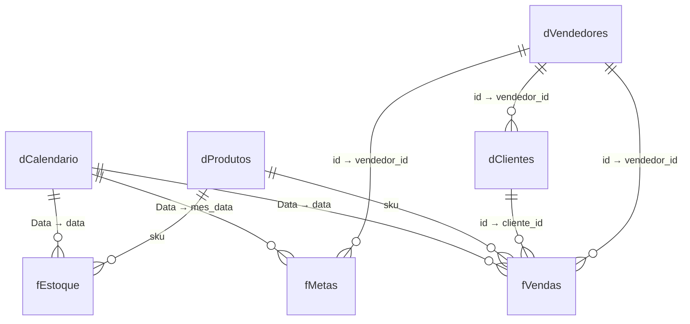

# Especificação do dashboard Power BI — Distribuidora Serra Azul

> **Estudo de caso demonstrativo** — empresa fictícia com dados sintéticos.
> Este documento é a especificação completa para montagem manual do `.pbix`
> (Fase 2b do [PLANO_PROJETO.md](../../PLANO_PROJETO.md)). Assume **Power BI
> Desktop em PT-BR**, versão recente (2025+). Os dados vêm dos 7 CSVs de
> [`data/`](data/) — dicionário completo no [README.md](README.md).

**O que o dashboard deve "descobrir"** (padrões plantados nos dados):
sazonalidade de verão, curva ABC (top-50 SKUs ≈ 74% da receita), ruptura em
~8% dos pedidos concentrada nos top-50, 90 clientes esfriando (churn) em
mar–jun/2026 e os vendedores **3 e 9** abaixo da meta.

---

## 1. Fontes e ETL (Power Query)

### 1.1 Regra geral de importação

Todos os CSVs são **UTF-8, separador vírgula, decimais com ponto e datas ISO
`YYYY-MM-DD`**. Ao importar (Página Inicial → Obter dados → Texto/CSV):

1. Confirme **Origem do arquivo = 65001: Unicode (UTF-8)** e **Delimitador =
   Vírgula**.
2. Para colunas de valor (`preco_tabela`, `custo`, `preco_unit`, `desconto`):
   clique com o botão direito no cabeçalho → **Alterar Tipo → Usando
   Localidade… → Número Decimal / Inglês (Estados Unidos)**. Sem isso, o
   locale PT-BR interpreta `78.90` como `7890`.
3. Colunas de data ISO podem usar **Usando Localidade… → Data / Inglês
   (Estados Unidos)** (o formato `YYYY-MM-DD` também converte sem erro no
   locale PT-BR, mas padronize com localidade para eliminar ambiguidade).

### 1.2 Consultas e transformações

| Consulta (nome final) | Origem | Transformações |
|---|---|---|
| `pedidos` *(staging — desabilitar carga)* | `pedidos.csv` | Tipos: `id`, `cliente_id`, `vendedor_id` → Número Inteiro; `data` → Data; `status` → Texto. Botão direito na consulta → **desmarcar "Habilitar carga"** (ela só alimenta o merge de `fVendas`). |
| `fVendas` | `itens_pedido.csv` | ① Tipos: `pedido_id`, `qtd`, `flag_ruptura` → Número Inteiro; `preco_unit`, `desconto` → Número Decimal (localidade en-US); `sku` → Texto. ② **Página Inicial → Mesclar Consultas**: com `pedidos`, chave `pedido_id` = `id`, tipo **Externa Esquerda**. ③ Expandir a coluna mesclada trazendo **somente** `cliente_id`, `vendedor_id`, `data`, `status` (sem prefixo). |
| `fEstoque` | `estoque_movimentos.csv` | Tipos: `data` → Data; `sku`, `tipo` → Texto; `qtd`, `saldo` → Número Inteiro. |
| `fMetas` | `metas.csv` | ① Tipos: `vendedor_id`, `meta_valor` → Número Inteiro; `mes` → Texto. ② **Adicionar Coluna → Coluna Personalizada** `mes_data` = `Date.FromText([mes] & "-01")`, tipo Data. |
| `dClientes` | `clientes.csv` | Tipos: `id`, `vendedor_id` → Número Inteiro; `data_cadastro` → Data; demais → Texto. |
| `dProdutos` | `produtos.csv` | Tipos: `preco_tabela`, `custo` → Número Decimal (localidade en-US); demais → Texto. |
| `dVendedores` | `vendedores.csv` | Tipos: `id` → Número Inteiro; `data_admissao` → Data; `nome`, `regiao` → Texto. |

Grão de `fVendas`: **1 linha = 1 item de pedido** (~207 mil linhas). A receita
de uma linha é `qtd × preco_unit`; **análises de receita consideram apenas
`status = "entregue"`** — regra aplicada nas medidas, não no ETL (manter os
cancelados permite contá-los).

### 1.3 Dica de manutenção

Crie um **parâmetro** `PastaDados` (Gerenciar Parâmetros) com o caminho da
pasta `data/` e use-o na linha `Source` de cada consulta
(`Csv.Document(File.Contents(PastaDados & "clientes.csv"), …)`). Trocar de
máquina passa a ser editar um único valor.

---

## 2. Modelo estrela

### 2.1 Tabela calculada `dCalendario` (DAX)

Modelagem → **Nova Tabela**:

```dax
dCalendario =
ADDCOLUMNS(
    CALENDAR(DATE(2024, 1, 1), DATE(2026, 6, 30)),
    "Ano", YEAR([Date]),
    "MesNum", MONTH([Date]),
    "Mes", FORMAT([Date], "MMM", "pt-BR"),
    "MesAno", FORMAT([Date], "MMM/yy", "pt-BR"),
    "AnoMes", FORMAT([Date], "yyyy-MM"),
    "Trimestre", YEAR([Date]) & "-T" & QUARTER([Date]),
    "DiaSemana", FORMAT([Date], "ddd", "pt-BR")
)
```

Depois de criar:

1. Renomeie a coluna `Date` para `Data`.
2. Selecione a tabela → **Marcar como tabela de data** (coluna `Data`).
3. `Mes` → Classificar por coluna → `MesNum`; `MesAno` → Classificar por
   coluna → `AnoMes`.

### 2.2 Relacionamentos

Todos **1:\*** com filtro em **direção única** (da dimensão para o fato):

| De (lado 1) | Para (lado \*) | Ativo |
|---|---|---|
| `dCalendario[Data]` | `fVendas[data]` | ✅ |
| `dCalendario[Data]` | `fEstoque[data]` | ✅ |
| `dCalendario[Data]` | `fMetas[mes_data]` | ✅ |
| `dProdutos[sku]` | `fVendas[sku]` | ✅ |
| `dProdutos[sku]` | `fEstoque[sku]` | ✅ |
| `dClientes[id]` | `fVendas[cliente_id]` | ✅ |
| `dVendedores[id]` | `fVendas[vendedor_id]` | ✅ |
| `dVendedores[id]` | `fMetas[vendedor_id]` | ✅ |
| `dVendedores[id]` | `dClientes[vendedor_id]` | ✅ |



> O elo `dVendedores → dClientes` é um floco (snowflake) proposital: permite
> filtrar clientes pela carteira do vendedor. Mantenha a direção única para
> evitar ambiguidade.

---

## 3. Medidas DAX

Crie uma tabela vazia `_Medidas` (Inserir dados → tabela em branco, sem
colunas carregadas) e mova todas as medidas para ela, organizadas nas pastas
de exibição indicadas. **Todas as medidas abaixo têm código completo** — copie
e cole.

### 3.1 Pasta "Vendas"

```dax
Receita =
CALCULATE(
    SUMX(fVendas, fVendas[qtd] * fVendas[preco_unit]),
    fVendas[status] = "entregue"
)
```
*Formato: R$ #.##0 (moeda, 0 casas).*

```dax
Receita LY =
CALCULATE([Receita], SAMEPERIODLASTYEAR(dCalendario[Data]))
```
*Formato: moeda, 0 casas.*

```dax
Var. Receita YoY % =
DIVIDE([Receita] - [Receita LY], [Receita LY])
```
*Formato: percentual, 1 casa.*

```dax
Receita YTD =
TOTALYTD([Receita], dCalendario[Data])
```
*Formato: moeda, 0 casas.*

```dax
Pedidos Entregues =
CALCULATE(
    DISTINCTCOUNT(fVendas[pedido_id]),
    fVendas[status] = "entregue"
)
```
*Formato: número inteiro com separador de milhar.*

```dax
Ticket Médio =
DIVIDE([Receita], [Pedidos Entregues])
```
*Formato: moeda, 2 casas.*

```dax
Caixas Vendidas =
CALCULATE(SUM(fVendas[qtd]), fVendas[status] = "entregue")
```
*Formato: número inteiro com separador de milhar.*

```dax
Desconto Médio % =
CALCULATE(AVERAGE(fVendas[desconto]), fVendas[status] = "entregue") / 100
```
*Formato: percentual, 2 casas. (A coluna `desconto` guarda pontos percentuais:
`5.00` = 5%.)*

### 3.2 Pasta "Rentabilidade"

```dax
Custo das Vendas =
CALCULATE(
    SUMX(fVendas, fVendas[qtd] * RELATED(dProdutos[custo])),
    fVendas[status] = "entregue"
)
```
*Formato: moeda, 0 casas.*

```dax
Margem Bruta =
[Receita] - [Custo das Vendas]
```
*Formato: moeda, 0 casas.*

```dax
Margem % =
DIVIDE([Margem Bruta], [Receita])
```
*Formato: percentual, 1 casa.*

### 3.3 Pasta "Ruptura e Estoque"

```dax
Pedidos com Ruptura =
CALCULATE(
    DISTINCTCOUNT(fVendas[pedido_id]),
    fVendas[status] = "entregue",
    fVendas[flag_ruptura] = 1
)
```
*Formato: número inteiro.*

```dax
% Pedidos com Ruptura =
DIVIDE([Pedidos com Ruptura], [Pedidos Entregues])
```
*Formato: percentual, 1 casa. É o KPI-síntese da dor do case (~8% no total).*

```dax
Estoque Atual =
VAR DataRef = MAX(dCalendario[Data])
RETURN
    CALCULATE(
        SUM(fEstoque[qtd]),
        fEstoque[data] <= DataRef,
        REMOVEFILTERS(dCalendario)
    )
```
*Formato: número inteiro. Como `qtd` é assinada (entrada +, saída/ajuste −), a
soma acumulada até a data de referência **é** o saldo — funciona para
qualquer subconjunto de SKUs e qualquer data selecionada no relatório.*

```dax
Dias de Cobertura =
VAR DataRef = MAX(dCalendario[Data])
VAR VendaMediaDia =
    DIVIDE(
        CALCULATE(
            SUM(fVendas[qtd]),
            fVendas[status] = "entregue",
            DATESBETWEEN(dCalendario[Data], DataRef - 29, DataRef)
        ),
        30
    )
RETURN
    DIVIDE([Estoque Atual], VendaMediaDia)
```
*Formato: número, 1 casa. Estoque atual ÷ venda média diária dos últimos 30
dias.*

```dax
SKUs em Risco de Ruptura =
COUNTROWS(
    FILTER(
        VALUES(dProdutos[sku]),
        VAR Cobertura = [Dias de Cobertura]
        RETURN NOT ISBLANK(Cobertura) && Cobertura < 7
    )
)
```
*Formato: número inteiro. Mesma regra (< 7 dias de cobertura) usada pelo
alerta do Power Automate — ver [`automacao/fluxo_ruptura.md`](automacao/fluxo_ruptura.md).*

### 3.4 Pasta "Clientes"

```dax
Clientes Ativos =
CALCULATE(DISTINCTCOUNT(fVendas[cliente_id]), fVendas[status] = "entregue")
```
*Formato: número inteiro.*

```dax
Clientes em Risco de Churn =
VAR DataRef = CALCULATE(MAX(fVendas[data]), REMOVEFILTERS())
VAR IniAtual = DataRef - 89
VAR IniLY = EDATE(IniAtual, -12)
VAR FimLY = EDATE(DataRef, -12)
RETURN
    COUNTROWS(
        FILTER(
            VALUES(dClientes[id]),
            VAR PedAtual =
                CALCULATE(
                    DISTINCTCOUNT(fVendas[pedido_id]),
                    fVendas[status] = "entregue",
                    DATESBETWEEN(dCalendario[Data], IniAtual, DataRef)
                )
            VAR PedAnoAnterior =
                CALCULATE(
                    DISTINCTCOUNT(fVendas[pedido_id]),
                    fVendas[status] = "entregue",
                    DATESBETWEEN(dCalendario[Data], IniLY, FimLY)
                )
            RETURN
                PedAnoAnterior >= 6 && PedAtual <= PedAnoAnterior * 0.5
        )
    )
```
*Formato: número inteiro. Regra: cliente frequente (≥ 6 pedidos no mesmo
trimestre do ano anterior) que caiu para ≤ 50% dessa frequência nos últimos
90 dias da base. A comparação é com o **mesmo período do ano anterior** de
propósito: comparar com o trimestre imediatamente anterior confunde
sazonalidade (verão → baixa temporada) com churn e infla o número. Deve
encontrar ≈ 98 clientes — os ~90 do padrão plantado de churn de mar–jun/2026
mais um resíduo de ruído. Mesma regra do `resumo_ia.py`.*

### 3.5 Pasta "Curva ABC"

```dax
Receita Top-50 SKUs =
VAR Top50 =
    TOPN(
        50,
        ALL(dProdutos[sku]),
        CALCULATE([Receita], REMOVEFILTERS(dCalendario)),
        DESC
    )
RETURN
    CALCULATE([Receita], KEEPFILTERS(Top50))
```
*Formato: moeda, 0 casas. O ranking dos 50 é fixo (receita de todo o período),
para o conjunto não mudar conforme o filtro de data.*

```dax
% Receita Top-50 =
DIVIDE([Receita Top-50 SKUs], [Receita])
```
*Formato: percentual, 1 casa. Deve mostrar ≈ 74% no período completo — a
curva ABC plantada.*

### 3.6 Pasta "Metas"

```dax
Meta =
SUM(fMetas[meta_valor])
```
*Formato: moeda, 0 casas.*

```dax
% Atingimento da Meta =
DIVIDE([Receita], [Meta])
```
*Formato: percentual, 1 casa. Nos vendedores 3 e 9 fica < 100% em ≥ 25 dos 30
meses (padrão plantado).*

**Total: 22 medidas.**

---

## 4. Layout das 4 páginas

Configuração comum: canvas **16:9 (1280 × 720)**, plano de fundo `#F5F7FA`,
cards e visuais com fundo branco, cantos arredondados 8 px e sombra suave.

**Tema de cores** (Exibição → Temas → Personalizar):

| Uso | Cor |
|---|---|
| Primária (receita, séries principais) | `#1B4F72` (azul-serra) |
| Secundária (comparativos, LY, meta) | `#85C1E9` |
| Alerta (ruptura, risco, abaixo da meta) | `#C0392B` |
| Positivo (meta batida, crescimento) | `#1E8449` |
| Neutro (textos, eixos) | `#5D6D7E` |

Convenções: todo visual tem título curto em "Sentence case"; tooltips padrão
habilitados; rótulos de dados apenas onde indicado; valores monetários
exibidos em milhares/milhões automático.

### 4.1 Página "Visão Executiva"

**Objetivo:** o diretor entende a saúde do negócio em 30 segundos — receita,
tendência, margem e as duas dores (ruptura e clientes esfriando).
**Padrões revelados:** sazonalidade de verão; ruptura ~8%.

| # | Visual | Campos / medidas | Posição |
|---|---|---|---|
| 1 | Segmentação de dados (lista suspensa) | `dCalendario[Ano]` | topo direito |
| 2 | 5 Cartões | `[Receita]`, `[Var. Receita YoY %]`, `[Margem %]`, `[% Pedidos com Ruptura]`, `[Ticket Médio]` | faixa superior, lado a lado |
| 3 | Gráfico de linhas | Eixo X: `dCalendario[MesAno]`; Y: `[Receita]` e `[Receita LY]` (linha tracejada secundária) | meia largura, centro-esquerda |
| 4 | Gráfico de colunas empilhadas | Eixo X: `dCalendario[MesAno]`; Y: `[Receita]`; Legenda: `dProdutos[categoria]` | meia largura, centro-direita |
| 5 | Cartão com destaque (cor Alerta) | `[Clientes em Risco de Churn]` — subtítulo "clientes esfriando (90 dias)" | faixa inferior esquerda |
| 6 | Cartão com destaque (cor Alerta) | `[SKUs em Risco de Ruptura]` — subtítulo "SKUs com cobertura < 7 dias" | faixa inferior centro |
| 7 | Gráfico de barras | Eixo Y: `dVendedores[regiao]`; X: `[Receita]` | faixa inferior direita |

O visual 3 é o "momento uau" da sazonalidade: picos em dez–fev, vale em
abr–mai, visíveis nos dois anos.

### 4.2 Página "Vendas & Clientes"

**Objetivo:** de onde vem a receita (categoria, PDV, cliente) e **quais
clientes estão esfriando** antes de sumirem.
**Padrão revelado:** os ~90 clientes de churn de mar–jun/2026.

| # | Visual | Campos / medidas | Posição |
|---|---|---|---|
| 1 | Segmentações | `dCalendario[Ano]`, `dVendedores[regiao]`, `dClientes[tipo_pdv]` | coluna esquerda |
| 2 | 3 Cartões | `[Clientes Ativos]`, `[Pedidos Entregues]`, `[Ticket Médio]` | faixa superior |
| 3 | Treemap | Grupo: `dProdutos[categoria]`; Detalhes: `dProdutos[marca]`; Valores: `[Receita]` | centro-esquerda |
| 4 | Gráfico de barras | Eixo Y: `dClientes[nome_fantasia]` (Top 10 por `[Receita]` — filtro Top N do painel de filtros); X: `[Receita]` | centro-direita |
| 5 | Tabela "Clientes em risco" | `dClientes[nome_fantasia]`, `dClientes[tipo_pdv]`, `dClientes[cidade]`, `dVendedores[nome]`, `[Pedidos Entregues]`, `[Receita]` — com filtro de nível de visual: `dCalendario[Data]` nos últimos 90 dias da base; ordenar por `[Pedidos Entregues]` crescente | faixa inferior, largura total |
| 6 | Gráfico de linhas | Eixo X: `dCalendario[MesAno]`; Y: `[Clientes Ativos]` | acima da tabela, meia largura |

O visual 6 mostra a queda de clientes ativos a partir de mar/2026 — a porta
de entrada para a análise de churn; a tabela 5 diz **quem** procurar.

### 4.3 Página "Estoque & Ruptura"

**Objetivo:** a dor central do case — onde e quando falta produto, e quais
SKUs precisam de reposição agora.
**Padrões revelados:** ruptura concentrada nos top-50 e nos meses de verão;
curva ABC.

| # | Visual | Campos / medidas | Posição |
|---|---|---|---|
| 1 | Segmentações | `dCalendario[Ano]`, `dProdutos[categoria]` | topo direito |
| 2 | 4 Cartões | `[% Pedidos com Ruptura]`, `[SKUs em Risco de Ruptura]`, `[Estoque Atual]`, `[% Receita Top-50]` | faixa superior |
| 3 | Gráfico de linhas | Eixo X: `dCalendario[MesAno]`; Y: `[% Pedidos com Ruptura]` (cor Alerta) | meia largura, centro-esquerda |
| 4 | Gráfico de barras | Eixo Y: `dProdutos[descricao]` (Top 15 por `[Pedidos com Ruptura]` — filtro Top N); X: `[Pedidos com Ruptura]` | meia largura, centro-direita |
| 5 | Tabela "Reposição urgente" | `dProdutos[sku]`, `dProdutos[descricao]`, `dProdutos[categoria]`, `[Estoque Atual]`, `[Dias de Cobertura]`, `[Caixas Vendidas]` — filtro de visual: `[Dias de Cobertura]` < 14; formatação condicional na coluna `[Dias de Cobertura]`: < 7 fundo `#C0392B` texto branco, 7–14 fundo `#F5B041` | faixa inferior, largura total |

O visual 3 evidencia que a ruptura sobe junto com o pico de vendas (verão) —
o argumento do case de que a reposição não acompanha a sazonalidade.

### 4.4 Página "Metas & Vendedores"

**Objetivo:** desempenho comercial individual — quem bate meta, quem não
bate, e desde quando.
**Padrão revelado:** vendedores 3 e 9 consistentemente abaixo da meta.

| # | Visual | Campos / medidas | Posição |
|---|---|---|---|
| 1 | Segmentações | `dCalendario[Ano]`, `dVendedores[regiao]` | topo direito |
| 2 | 3 Cartões | `[Receita]`, `[Meta]`, `[% Atingimento da Meta]` | faixa superior |
| 3 | Gráfico de colunas clusterizado | Eixo X: `dVendedores[nome]`; Y: `[Receita]` (primária) e `[Meta]` (cor secundária) | meia largura, centro-esquerda |
| 4 | Matriz | Linhas: `dVendedores[nome]`; Colunas: `dCalendario[AnoMes]`; Valores: `[% Atingimento da Meta]` — formatação condicional de fundo: < 100% `#C0392B` (texto branco), ≥ 100% `#1E8449` (texto branco) | meia largura, centro-direita (com rolagem horizontal) |
| 5 | Gráfico de linhas | Eixo X: `dCalendario[MesAno]`; Y: `[% Atingimento da Meta]`; Legenda: `dVendedores[nome]` — linha de referência constante em 100% (linha Y) | faixa inferior, largura total |

Na matriz 4, as linhas dos vendedores 3 e 9 ficam quase inteiras vermelhas —
é o print que vai para o case.

---

## 5. Checklist de montagem (ponte para a Fase 2b)

Ordem de execução no Power BI Desktop:

1. [ ] Importar os 7 CSVs conforme a seção 1 (tipos + localidade en-US nos
       decimais; carga de `pedidos` desabilitada; merge de `fVendas` feito).
2. [ ] Criar `dCalendario`, marcar como tabela de data e configurar as
       classificações de coluna (seção 2.1).
3. [ ] Conferir/criar os 9 relacionamentos da seção 2.2 (todos 1:\*, direção
       única).
4. [ ] Criar a tabela `_Medidas` e as 22 medidas da seção 3, com formatos e
       pastas de exibição.
5. [ ] Validar contra os padrões plantados (teste rápido em visual de cartão,
       sem filtros): `[Receita]` total ≈ R$ 121 mi (média R$ 4,04 mi/mês);
       `[% Pedidos com Ruptura]` ≈ 8%; `[% Receita Top-50]` ≈ 74%;
       `[Clientes em Risco de Churn]` ≈ 98.
6. [ ] Montar as 4 páginas da seção 4, nesta ordem de abas: **Visão
       Executiva · Vendas & Clientes · Estoque & Ruptura · Metas &
       Vendedores** (nomes exatos — o case e os screenshots referenciam esses
       títulos).
7. [ ] Aplicar o tema de cores e as convenções de formatação (seção 4).
8. [ ] Publicar no Power BI Service (workspace pessoal) → **Arquivo →
       Inserir relatório → Publicar na web (público)** → copiar a URL do
       iframe. Essa URL substitui o placeholder `[URL_PUBLISH_TO_WEB]` na
       Fase 6. *Aceitável somente porque os dados são 100% sintéticos — nunca
       usar Publish to web com dados reais de cliente.*
9. [ ] Capturar 1 screenshot PNG por página (janela do relatório publicado,
       ~1600 px de largura) e salvar em `public/` com estes nomes:
       - `public/dashboard-visao-executiva.png`
       - `public/dashboard-vendas-clientes.png`
       - `public/dashboard-estoque-ruptura.png`
       - `public/dashboard-metas-vendedores.png`
10. [ ] Conferir os critérios binários da Fase 2b (seção 7 do
        PLANO_PROJETO.md): URL pública carrega em navegador anônimo; as 4
        páginas existem com os nomes da spec; 4 PNGs em `public/`.
